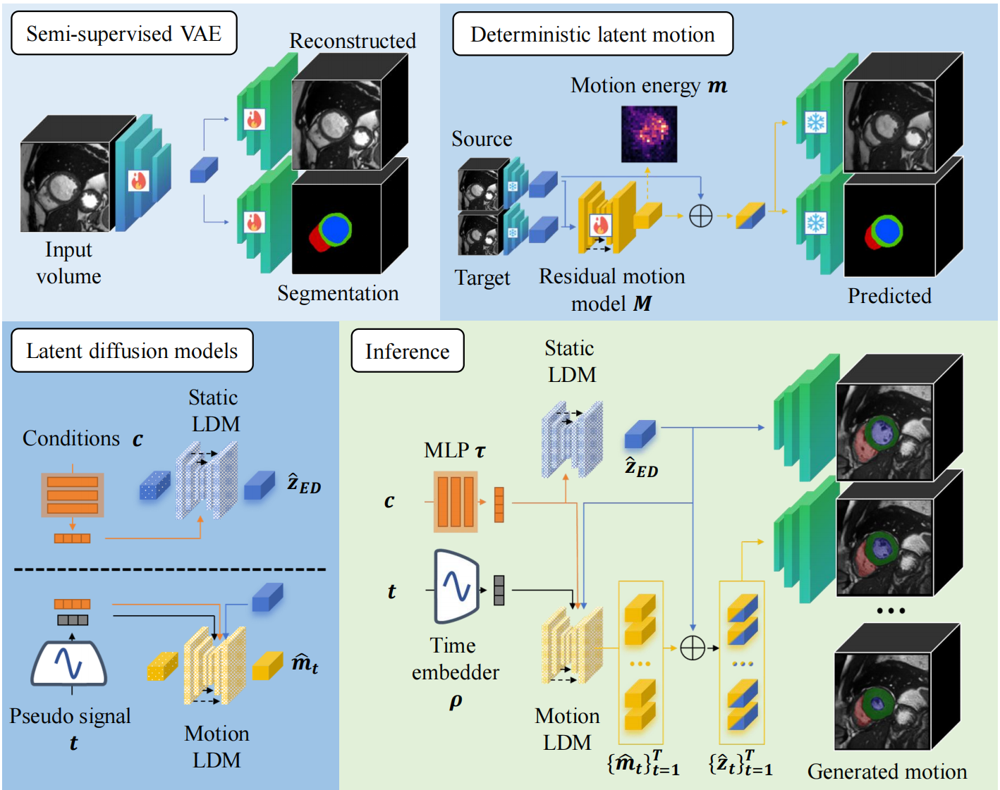
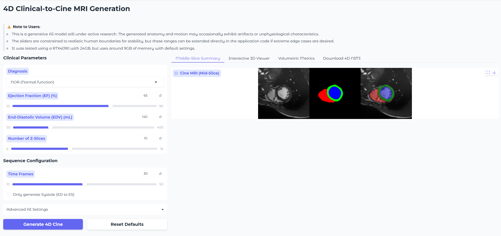

# Anatomy-Guided Residual Motion Diffusion for Controllable 4D Cardiac MRI Synthesis


This repository will share the code later after cleaning it :)

<p align="center">
  
</p>

<!-- TODO: Add architecture diagram here 
This repository shares source code to run [training](#training-from-scratch), [inference](#inference), and a standalone gradio [demo](#demo) to generate motion from a text prompt.


## Demo

1. Clone the repository:
```bash
git clone https://github.com/cyiheng/TextToCine2DMRI
cd TextToCine2DMRI
```

2. Create a virtual environment:
```bash
conda create -n text2cine python=3.10
conda activate text2cine
pip install torch==2.6.0 torchvision==0.21.0 torchaudio==2.6.0 --index-url https://download.pytorch.org/whl/cu118
pip install -r demo/demo_requirements.txt
```
3. Download the pre-trained weights for the demo and place them in the `results/` folder：
- Google Drive (not available yet, will update soon)
- [Baidu](https://pan.baidu.com/s/1NybeuS2JwO1jjmhhTqm6KA?pwd=jeua)

4. Run the gradio demo with the command:
```bash
python -m demo.app
```



## Training from scratch

### Dependencies

1. Clone the repository:
```bash
git clone https://github.com/cyiheng/TextToCine2DMRI
cd TextToCine2DMRI
```

2. Create a virtual environment:
```bash
conda create -n text2cine python=3.10
conda activate text2cine
pip install torch==2.6.0 torchvision==0.21.0 torchaudio==2.6.0 --index-url https://download.pytorch.org/whl/cu118
pip install -r requirements.txt
```

### Data preparation
1. Download both [ACDC](https://www.creatis.insa-lyon.fr/Challenge/acdc/databases.html) and [Kaggle](https://www.kaggle.com/competitions/second-annual-data-science-bowl/overview) dataset in the folder `data/` and unzip them.
2. Use the preprocessing of [CineMA](https://github.com/mathpluscode/CineMA)
3. Make sure the preprocessed data is saved in folder `data/ACDC_preprocessed` and `data/DSB_nifti`. It will also generate the metadata.csv files for both datasets.

-->

<!-- 
If you use this code for your research, please cite our papers.

```
TODO
```
-->
